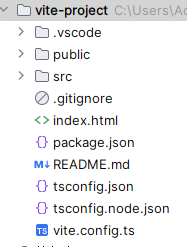

# 从0开始搭建Vite+Vue3+Pinia后台管理系统(一)－框架初始配置

预览地址：https://337547038.github.io/vite-frame/
源码-github：https://github.com/337547038/vite-frame

系列文章：
1.从0开始搭建Vite+Vue3+Pinia后台管理系统(一)－框架初始配置
2.从0开始搭建Vite+Vue3+Pinia后台管理系统(二)－框架搭建
3.从0开始搭建Vite+Vue3+Pinia后台管理系统(三)－表单组件封装
4.从0开始搭建Vite+Vue3+Pinia后台管理系统(四)－列表组件封装

## 前言

先回答一个问题：
市面上有着非常多的成熟后台框架管理系统，为什么还要从0开始搭建？

1.定制化需求：根据自己的业务需求进行定制开发，满足特定的功能和界面需求。成熟的框架可能无法满足所有项目的要求，需要进行扩展和定制。

2.业务逻辑复杂：某些项目的业务逻辑可能非常复杂或相对简单，需要自己搭建一个定制化的管理系统来处理这些逻辑，提高开发效率和代码质量。

3.提升开发速度：通过自己搭建后台框架管理系统，可以减少重复代码的编写，提高代码复用性，从而提升开发速度。

4.代码更简洁：自己搭建的框架管理系统代码更简洁、更轻量、更加符合开发习惯。成熟的框架模板都相对复杂，集成了太多不实用或跟需求无关的东西，学习成本较高。

5.技术掌握和学习：通过自己搭建框架管理系统，可以更好地学习和掌握相关技术。自己搭建过程中会遇到一些技术挑战和问题，通过解决这些问题可以加深对技术的理解和掌握。

## 开发环境

| 名称           | 版本      |
|--------------|---------|
| node         | 16.15.x |
| pnpm         | 8.6.x   |
| vite         | 4.4.x   |
| vue          | 3.3.x   |
| element-plus | 2.3.x   |

## 实现功能

集成 Element-Plus组件库
集成 eslint + prettier，代码约束和格式化统一
集成 pinia，vuex 的替代方案，轻量、简单、易用
集成icon图片合成
封装常用表单、列表组件
……

## 进入主题

### 创建项目

使用 PNPM 运行以下命令，然后按照提示操作即可！可根据需求选择js或是ts（选择ts创建的项目也可使用js来开发，反之则不行）

  ```
  pnpm create vite
  ```

不出意外，会在创建目录下生成以下目录及文件：（这里选择了ts）

:

通过安装依懒，启动开发服务，浏览器输入`http://127.0.0.1:5173`即可进入开发页面。

### 路由配置

```
  pnpm add vue-router
  ```

1.src下新建路由文件`/src/router/index.ts` 或者是 `/src/router.ts`等都可以，写入以下内容：

```javascript
import {createRouter, RouteRecordRaw, createWebHistory} from 'vue-router'

const routes: Array<RouteRecordRaw> = [
  {
    path: '/',
    name: '/home',
    component: () => import('../views/index.vue')
  }
]
// 配置路由
const router = createRouter({
  history: createWebHistory(),
  routes: routes
})

export default router

```

2.修改main.ts

```javascript
import {createApp} from 'vue'
import router from './router'
import App from './App.vue'

createApp(App).use(router).mount('#app')

```

3.修改app.vue

```html

<template>
  <router-view v-slot="{ Component }">
    <component :is="Component"/>
  </router-view>
</template>

```

至此路由配置就已经完成了，开发中有路由需要增删则在`router.ts`
里增删相应代码。这样子没毛病但很影响开发效率，这里给推荐一款可根据目录自动生成路由的插件`vite-plugin-pages`。改造为：

```
  pnpm add vite-plugin-pages -D
  ```

1.`vue.config.ts`配置

```javascript
import Pages from 'vite-plugin-pages'

plugins: [
  Pages({
    pagesDir: 'src/views', // 指定入口页面
    extensions: ['vue'], // 指定入品文件类型
    exclude: ['**/components/*.vue'] // 排除的文件
  })
]
```

2.`/src/router/index.ts`修改为：

```javascript
import {createRouter, createWebHistory} from 'vue-router'
import routes from '~pages'

const router = createRouter({
  history: createWebHistory(),
  routes: routes
})

export default router

```

### 配置axios

```
  pnpm add axios
  ```

1.新建`/src/utils/request.ts`,内容：

```javascript
import axios from 'axios'

const service = axios.create({
  baseURL: '', // api的base_url
  timeout: 6000, // request timeout
  headers: {}
})

service.interceptors.request.use(
  config => {
    return config
  },
  error => {
    Promise.reject(error)
  }
)

service.interceptors.response.use(
  response => {
    return response
  },
  error => {
    return Promise.reject(error)
  }
)
export default service

```

2.新建`/src/api/index.ts`

```typescript
import request from '../utils/request'

const api: any = {
  login: '/getLogin',
  getToken: '/getToken',
  getContentById: "/contens/$id" // id为动态时
}
export const getRequest = (apiKey: string, data?: any, options = {}) => {
  const optApiKey = options.apiKey || {}
  let url = api[apiKey] || apiKey
  // 解决动态url 如/api/delete/id(id为动态时)
  // 1.url设置为：/api/delete/$id
  // 2.options参数设置：options:{apikey:{$id:xx}}
  if (Object.keys(optApiKey).length) {
    for (const key in optApiKey) {
      url = url.replace(key, optApiKey[key])
    }
  }
  const obj: any = Object.assign(
    {
      url: '/api/' + url, // 添加个前缀
      method: 'POST',
      data
    },
    options
  )
  return request(obj)
}

```

使用此方法封装的好处：
> 无需每个请求都写一个方法
> 页面中多个请求时无需每个都导入或是批量导入
> 支持动态url动态参数

```javascript
// 不需要为每个接口写一个方法，如
export function login(data) {
  return request({
    url: '/login',
    method: 'GET'
  })
}
// 使用时不需要每个都需要导入，涉及到调整时还要手动移除，如
import {login,xxxx} from '/api'
```

3.在页面中使用请求
```javascript
import {getRequest} from '/api'

// 1.常规使用
getRequest('login', params).then(res => {
  // 结果返回处理逻辑
})

// 2.动态api时请求如：即可被转换为 /contens/1
getRequest('getContentById', params,{apikey:{$id:1}}).then(res => {
  // 结果返回处理逻辑
})

// 3.参数1也可直接传api，如
getRequest('getUser/info/list', params).then(res => {
  // 结果返回处理逻辑
})
```


### Pinia配置

```
  pnpm add pinia
  ```

1.创建目录及文件，如`/src/store/index.ts`，并写入如下内容：

```javascript
import {defineStore} from 'pinia'

export const piniaTest = defineStore('piniaTest', {
  state: () => {
    return {
      name: '初始值'
    }
  },
  // 也可以定义为
  // state: () => ({ count: 0 })
  actions: {
    changeName(data: any) {
      this.name = data
    }
  }
})

```

2.在`main.ts`里配置，修改为：

```javascript
import {createApp} from 'vue'
import router from './router'
import App from './App.vue'
import {createPinia} from 'pinia'

const pinia = createPinia()

createApp(App).use(router).use(pinia).mount('#app')

```

3.新建测试页，代码如下：（可以看到name的初始值为"初始值"，并点击按钮可以改变值则为配置成功）

```vue

<template>
  <div>
    <div>pinia name:{{ usePinia.name }}</div>
    <div>
      <el-button @click="changeName">change name</el-button>
    </div>
  </div>
</template>
<script lang="ts" setup>
  import {piniaTest} from "../store";

  const usePinia = piniaTest()
  const changeName = () => {
    usePinia.changeName('修改后的值' + new Date().getTime())
  }
</script>


```

### eslint和prettier配置

```
  pnpm add @typescript-eslint/eslint-plugin @typescript-eslint/parser @vue/eslint-config-typescript eslint eslint-config-prettier eslint-plugin-prettier eslint-plugin-vue prettier vue-eslint-parser -D
  ```

以上包功能解释：

> @typescript-eslint/eslint-plugin 是一个 ESLint 插件，为 TypeScript 提供了额外的规则和功能。
> @typescript-eslint/parser 是一个将 TypeScript 转换为 ESTree 格式的解析器插件，以便 ESLint 可以分析 TypeScript 代码。
> @vue/eslint-config-typescript 是一个针对 Vue.js 项目中使用 TypeScript 的 ESLint 配置。
> eslint 是一个用于检测 JavaScript 代码错误和实施代码规范的工具。
> eslint-config-prettier 是一个用于关闭 ESLint 中与 Prettier 相关的规则的配置。
> eslint-plugin-prettier 是一个将 Prettier 规则集集成到 ESLint 中的插件。
> eslint-plugin-vue 是一个为 Vue.js 提供了额外的规则和功能的 ESLint 插件。
> prettier 是一个代码格式化工具，用于自动格式化代码。


1.新建`/src/.eslintrc.cjs`,写入以下内容：

```javascript
module.exports = {
  root: true,
  "env": {
    "browser": true,
    "es2021": true,
    "node": true
  },
  extends: [
    'plugin:vue/recommended', // 启用Vue相关规则
    'plugin:vue/vue3-essential',
    'eslint:recommended',
    '@vue/typescript/recommended',
    'prettier',
    'plugin:prettier/recommended'
  ],
  "parser": "vue-eslint-parser",
  "parserOptions": {
    "ecmaVersion": "latest",
    "sourceType": "module",
    "parser": "@typescript-eslint/parser"
  },
  "plugins": [
    "prettier",
    "vue",
    "@typescript-eslint"
  ],
  overrides: [
    {
      files: ['*.vue'],
      rules: {
        indent: 'off',
      },
    },
  ],
  rules: {
    // 根据实际需求配置一些规则即可
  }
}

```

2.新建`/src/.prettierrc.js`，配置如下：（具体规则可根据实际配置）

```javascript
module.exports = {
  semi: false, //是否在语句末尾加分号
  singleQuote: true, // 是否使用单引号，建议使用单引号
  trailingComma: 'none', // 多行数组和对象的最后一项是否添加逗号
  printWidth: 80, // 一行的字符数，超出会自动换行，默认为 80。
  tabWidth: 2, // 一个 tab 的宽度，建议设置为 2 （默认为 2）；
  bracketSpacing: true, //对象字面量的花括号之间是否添加空格，建议添加空格（即设置为 true）；
  jsxSingleQuote: false, // 语法中属性是否使用单引号，默认为 false（即用双引号）。//jsx 语法中属性是否使用单引号，默认为 false（即用双引号）。
  jsxBracketSameLine: false, //jsx 中的 > 是否与前面的内容在同一行，建议分行（即设置为 false）；
  arrowParens: 'avoid', //箭头函数的参数是否使用括号，建议不使用括号（即设置为 "avoid"）
  vueIndentScriptAndStyle: true,
  endOfLine: 'auto'
}

```

### 配置element-plus

```
  pnpm add element-plus @element-plus/icons-vue
  ```

1. `main.ts` 配置

```typescript
import {createApp} from 'vue'
import App from './App.vue'
import router from './router'
import {createPinia} from 'pinia'
import ElementPlus from 'element-plus'
import 'element-plus/dist/index.css'

const pinia = createPinia()
const app = createApp(App)
app.use(pinia).use(ElementPlus).use(router).use(AKFormList).mount('#app')

// 全局注册icon
import * as ElementPlusIconsVue from '@element-plus/icons-vue'

for (const [key, component] of Object.entries(ElementPlusIconsVue)) {
  app.component(key, component)
}

```

### 配置css精灵图合并

如果项目有比较多的小图需要合并成雪碧图，可使用插件`vite-plugin-sprites`，如若不需，可跳过
```
  pnpm add vite-plugin-sprites -D
  ```

1.vite.config配置

```javascript
import cssSprites from 'vite-plugin-sprites'

plugins: [
  cssSprites({
    iconPath: '/src/assets/icon', // icon图片位置，默认/src/assets/icon
    savePath: '/src/assets/icon', // 生成的图片样式存放目录，默认/src/assets/icon（插件不会创建目录，需确保存放路径存在）
    prefix: 'icon-' // 生成css类名前缀，默认 icon-
  })
]
```
2.将icon小图标保存到目录 `/src/assets/icon`，运行 `npm run dev` 或 `npm run build` 都可将目录下的icon图合并并生成合并图和相应的css。使用可参考 `https://github.com/337547038/vite-plugin-sprites`
